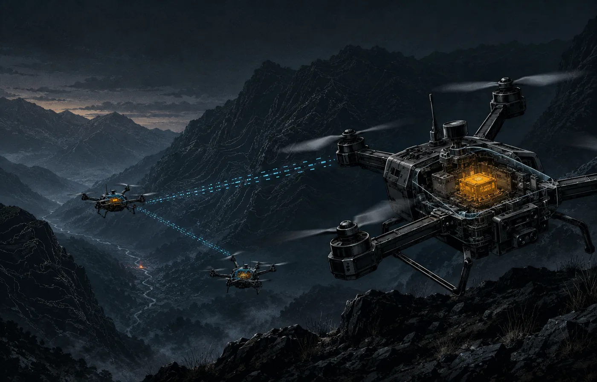

# ruv-drone

**Industrial cooperative-UAV fleet coordination, in Rust.**

[](https://latentmesh-flight-safe-mesh.ruv.chatgpt.site)

> [Explore the interactive LatentMesh architecture](https://latentmesh-flight-safe-mesh.ruv.chatgpt.site), including the signed message path, hard flight-safety boundary, transport behavior, practical missions, measured performance, and staged deployment plan.

`ruv-drone` is a coordination layer that sits *above* a per-vehicle autopilot
(PX4 / ArduPilot) and turns a set of drones into a coordinated fleet — formation
keeping, distributed consensus, cooperative task allocation, collision-avoidant
planning, and learned multi-agent navigation. It targets **civilian missions**:
search-and-rescue, infrastructure inspection, agriculture, mapping, and emergency
telecom relay.

Part of the [RuView / wifi-densepose](https://github.com/ruvnet/wifi-densepose)
ecosystem (ADR-148), with an optional WiFi-CSI sensing payload for through-structure
presence detection. Pure Rust, `async`, edge-deployable.

> **Scope — industrial / civilian.** Cooperative formation and collision avoidance,
> **not** military "swarming". This project does not implement adaptive behavior in
> response to threats or mission objectives, target acquisition/engagement, or weapons
> integration. Per the U.S. State Department's clarification distinguishing cooperative
> and formation operation from military swarming, the maintainer's assessment is that
> **USML Category VIII(h)(12) does not apply.** This is not legal advice; final export
> classification is the maintainer's / export counsel's responsibility. See [`NOTICE`](./NOTICE).

## Cooperative coordination vs. military swarming

The line this project deliberately stays on:

| Capability | `ruv-drone` (cooperative) | Military "swarming" (out of scope) |
|---|:---:|:---:|
| Relative positioning — formation keeping (virtual structure, leader-follower, flocking) | ✅ | — |
| De-confliction — collision avoidance (RRT-APF) | ✅ | — |
| Shared state — Raft consensus + gossip / mesh | ✅ | — |
| Tasking — cooperative task allocation (auction / FNN) | ✅ | — |
| Learning — MAPPO cooperative navigation | ✅ | — |
| Adaptive behavior in response to threats / mission objectives | ❌ not implemented | controlled |
| Target acquisition / tracking-to-engage / fire control | ❌ not implemented | controlled |
| Weapons or countermeasure integration | ❌ not implemented | controlled |

## Where it sits

`ruv-drone` is a **coordination layer**, not a flight controller — it complements,
rather than replaces, your autopilot and transport:

| Layer | Handled by |
|-------|------------|
| Per-vehicle flight control | PX4 / ArduPilot (via the `FlightController` trait; sim included) |
| Transport | MAVLink v2 (HMAC-SHA256 signed) / DDS; optional LatentMesh Air advisory telemetry |
| **Fleet coordination** | **`ruv-drone`** — consensus, formation, allocation, coverage planning |
| Sensing payload (optional) | WiFi-CSI pipeline (ESP32-S3 → edge), multi-drone fusion |

## Highlights

- **Hierarchical-mesh topology** — cluster heads over Raft consensus; inter-cluster gossip for map dissemination
- **Formation control** — virtual structure, leader-follower, Reynolds flocking
- **Collision-avoidant planning** — RRT\* with Artificial Potential Field reactive avoidance
- **3-phase area coverage** — boustrophedon sweep → Bayesian probability grid → multi-drone triangulation
- **Cooperative task allocation** — auction-based bidding with an FNN bid scorer
- **MAPPO multi-agent RL** — 64-dim local observation, CTDE training, optional INT8 (ONNX) inference; real Candle PPO under the `train` feature
- **Security hardening** — MAVLink v2 signing, UWB GPS anti-spoofing, onboard geofencing, Remote ID
- **LatentMesh advisory plane** — signed deterministic peer-state deltas, bounded multi-profile framing, replay defense, and default-deny mission coordination with no flight authority
- **RuForecast advisory** — bounded local battery/link/progress forecasting with receipts, abstention, shadow-first rollout, and reduce-only assignment gates
- **Fail-safe state machine** — 10-state, GCS-independent onboard safety
- **Sim & training** — synthetic CSI generation, Gazebo / PX4 SITL interface, TOML mission configs

## Quick start

```rust
use wifi_densepose_swarm::{config::SwarmConfig, demo::scenario::DemoScenario};

// Load a mission profile
let config = SwarmConfig::sar_default();

// Run a demo scenario
let scenario = DemoScenario::sar_rubble_field(4); // 4-drone SAR
let estimated_secs = scenario.estimate_coverage_time_secs();
// → < 240 s for 4 drones over 400×400 m
```

```bash
cargo build                 # core coordination layer
cargo build --features full # + mavlink, onnx, demo, latentmesh, ruforecast
cargo test
```

## Mission profiles

| Profile | Drones | Area | Application |
|---------|--------|------|-------------|
| `sar` | 6–12 | 400×400 m | Structural-collapse victim search |
| `inspection` | 3–6 | Linear corridor | Infrastructure (power lines, bridges) |
| `agriculture` | 4–12 | Field-configurable | NDVI mapping, variable-rate spraying |
| `mine` | 2–4 | Tunnel | GPS-denied underground exploration |
| `relay` | 6–20 | Perimeter | Emergency telecom relay chain |
| `demo` | Any | Configurable | Synthetic CSI, configurable scenarios |

## Crate features

| Feature | Description |
|---------|-------------|
| `default` | Core types, topology/consensus, formation, allocation, planning, sensing, failsafe, config, MARL |
| `mavlink` | MAVLink v2 protocol support |
| `onnx` | ONNX Runtime backend for MARL actor inference (INT8) |
| `simulation` / `demo` | Simulation mode + synthetic-CSI scenario runners |
| `train` / `cuda` | Real Candle autodiff PPO training (GPU optional) |
| `ruflo` | Ruflo AI-agent HTTP backend integration |
| `latentmesh` | Authenticated LatentMesh Air advisory telemetry and governed mission-coordination policy |
| `ruforecast` | Baseline-first, receipt-bound local predictive advisory (shadow by default) |
| `full` | `mavlink` + `onnx` + `demo` + `latentmesh` + `ruforecast` |

## RuForecast predictive advisory

The optional `ruforecast` feature pins the backend-neutral
`ruforecast-core` contract at an exact reviewed commit. Each drone retains at
most 128 local observations of battery percentage, link quality, and aggregate
mission progress. It produces deterministic last-value baseline forecasts with
request/output receipts and explicit expiry. Position, velocity, identity,
raw sensor data, and model weights never enter the forecast series.

```bash
cargo test --locked --features ruforecast --all-targets
cargo test --locked --features latentmesh,ruforecast --all-targets
cargo bench --locked --features ruforecast --bench ruforecast_bench
```

The default rollout is **shadow**: results are measured but cannot change any
decision. An explicit canary policy can only return “do not assign this drone
new cooperative work” when a fresh forecast crosses a local battery or link
threshold. Missing, invalid, stale, disabled, or abstaining forecasts preserve
existing behavior. Forecasting cannot actuate, modify topology, create tasks,
or enter/clear a fail-safe.

RuForecast currently reports that no learned configuration has reliably beaten
last-value and seasonal-naive baselines out of sample. For that reason this
release does not link `ruforecast-model` or claim learned predictive lift.
Learned activation requires the promotion evidence in
[ADR-174](./docs/adr/ADR-174-ruforecast-predictive-advisory.md). See the
[operator guide](./docs/ruforecast-user-guide.md), [threat model](./docs/security/ruforecast-threat-model.md),
and [benchmark protocol](./docs/benchmarks/ruforecast-integration.md).

## LatentMesh advisory communications

The optional `latentmesh` feature integrates the deterministic
`latentmesh-air-core` contract at an exact reviewed commit. It provides
canonical Q16.16 peer-state projection, Ed25519-signed semantic envelopes,
bounded fragmentation and reassembly, replay checkpoints, periodic recovery
keyframes, adaptive utility-per-byte scheduling, and WiFi/BLE/Meshtastic Air
profiles. A bounded Tokio channel and connected UDP datagram transport are
included for integration and deployment adapters.

```bash
cargo run --locked --features latentmesh --example latentmesh_loopback
cargo test --locked --features latentmesh --all-targets
cargo clippy --locked --features latentmesh --all-targets -- -D warnings
```

The loopback example builds two authenticated peers, fragments a signed state
update at a 64-byte MTU, delivers it through a bounded channel, verifies it,
and prints the admitted advisory and wire accounting. Start with the
[LatentMesh user guide](./docs/latentmesh-user-guide.md) before connecting a
real transport or enabling mission proposals.

LatentMesh output is deliberately non-authoritative. It terminates in a
short-lived advisory store and cannot arm, actuate, choose a flight mode,
publish position or velocity setpoints, override a geofence or fail-safe, or
write to the safety topology. Learned residuals in LatentMesh envelopes are
rejected in this initial integration. See [ADR-173](./docs/adr/ADR-173-latentmesh-comms-orchestration.md)
and the [threat model](./docs/security/latentmesh-threat-model.md). The
[interactive explainer](https://latentmesh-flight-safe-mesh.ruv.chatgpt.site)
shows this boundary visually on desktop and mobile.

### Current evidence and release boundary

| Evidence | Result |
|----------|--------|
| Default feature tests | 136 passed |
| LatentMesh feature tests | 191 passed |
| RuForecast feature tests | 143 passed |
| LatentMesh + RuForecast tests | 198 passed |
| No-default-feature tests | 136 passed |
| Cadence-limited 128-row observation | 183.96–235.14 ns |
| 128-row baseline forecast refresh | 11.385–12.003 µs |
| Reduce-only policy query | 690.74–764.99 ps |
| Local state projection | 386.62–397.98 ns |
| Sign and fragment at 64-byte MTU | 38.677–39.616 µs |
| Reassemble, verify, and admit | 47.952–51.988 µs |
| Deep security, STRIDE, and secrets scans | 0 findings |

These are local CPU and software-loopback results, not RF claims. Production
release still requires two-node hardware-in-the-loop and real-radio validation,
including latency percentiles, allocation behavior, packet loss and reordering,
restart recovery, clock drift, protected key storage, key rotation, disable
behavior, and regional RF compliance.

## Module structure

```
src/
├── types.rs       — NodeId, DroneState, SwarmTask, SwarmError, FailSafeState
├── topology/      — Raft consensus, gossip dissemination, MeshTopology
├── formation/     — VirtualStructure, LeaderFollower, Reynolds flocking
├── planning/      — RRT-APF planner, 3-phase coverage, Bayesian grid, pheromone
├── allocation/    — auction-based task allocation, FNN bid scorer
├── sensing/       — CSI payload pipeline, multi-drone fusion, OccWorld bridge
├── marl/          — MAPPO actor, LocalObservation, reward shaping, Candle PPO
├── security/      — MAVLink signing, UWB anti-spoofing, geofencing, Remote ID
├── failsafe/      — 10-state onboard fail-safe machine
├── config/        — TOML SwarmConfig with mission presets
├── demo/          — synthetic CSI, DemoScenario runners
├── latentmesh/    — Authenticated advisory state, transport, policy, and metrics
├── forecast/      — Bounded RuForecast history, receipts, shadow/canary policy
└── integration/   — FlightController trait (PX4 / ArduPilot / sim)
```

## Workspace crates

The repository is a Cargo workspace. The root package (`ruview-swarm`) is the
coordination layer; companion crates live under [`crates/`](./crates):

| Crate | ADR | Purpose |
|-------|-----|---------|
| [`ruv-jellyfish`](./crates/ruv-jellyfish) | ADR-172 | Jellyfish-inspired energy-efficient behaviors — pulse-and-drift gait and bloom aggregation for endurance-bound loiter (relay chains, SAR re-scan, persistent monitoring) |

```bash
cargo test -p ruv-jellyfish     # the companion crate builds/tests standalone
```

## Related ADRs

| ADR | Title | Relation |
|-----|-------|----------|
| ADR-148 | Drone Swarm Control System | This crate |
| ADR-172 | Jellyfish-Inspired Swarm Behaviors | Energy-efficient loiter/aggregation — [`crates/ruv-jellyfish`](./crates/ruv-jellyfish) |
| ADR-173 | LatentMesh Communications and Advisory Orchestration | Signed sparse peer state with a hard flight-authority boundary — [`docs/adr/ADR-173-latentmesh-comms-orchestration.md`](./docs/adr/ADR-173-latentmesh-comms-orchestration.md) |
| ADR-174 | RuForecast Predictive Advisory | Baseline-first local forecasting with shadow promotion and reduce-only authority — [`docs/adr/ADR-174-ruforecast-predictive-advisory.md`](./docs/adr/ADR-174-ruforecast-predictive-advisory.md) |
| ADR-147 | OccWorld Occupancy World Model | Environment prior via `sensing::occworld_bridge` |
| ADR-134 | CSI→CIR ISTA Sparse Recovery | Drone payload sensing |
| ADR-146 | RF Encoder Multitask Heads | Drone payload inference |
| ADR-016 | RuVector Training Integration | CrossViewpointAttention |

## Performance targets

Engineering targets (not yet independently benchmarked end-to-end), against the
single-drone Wi2SAR baseline:

| Metric | Wi2SAR baseline (1 drone) | 4-drone target |
|--------|--------------------------|----------------|
| Coverage | 160,000 m² | 160,000 m² |
| Time | 13.5 min | ≤ 4 min |
| Localization | 5 m | ≤ 2 m (3-view fusion) |
| MARL inference | N/A | ≤ 5 ms (INT8, release) |
| Raft election | N/A | ≤ 300 ms |

## Agent harness

`ruv-drone` ships a repo-aware **AI agent harness** in [`agent-harness/`](./agent-harness),
minted with [MetaHarness](https://github.com/ruvnet/agent-harness-generator) and wired for
**all 9 supported hosts** (Claude Code, Codex, OpenCode, Copilot, GitHub Actions, Hermes,
OpenClaw, pi.dev, RVM). Each host's config is verified against the real host runtime, and
the harness encodes this repo's **civilian-only scope** (see [`NOTICE`](./NOTICE)) and Rust
workflow (`cargo build/test/clippy/bench`) so agents stay on-task.

```bash
# use the harness with your host (drop into any of the 9 — see agent-harness/README.md)
cd agent-harness && npm install && npm test && node bin/cli.js doctor

# or mint a fresh copy yourself (one command, all 9 hosts):
npx metaharness@latest ruvdrone \
  --host claude-code --host codex,copilot,github-actions,hermes,openclaw,opencode,pi-dev,rvm \
  --template vertical:coding
```

Published to npm as [`ruvdrone`](https://www.npmjs.com/package/ruvdrone). Per-host install
notes live in [`agent-harness/docs/hosts/`](./agent-harness/docs/hosts).

## License

Apache-2.0. See [`NOTICE`](./NOTICE) for scope and export details.
