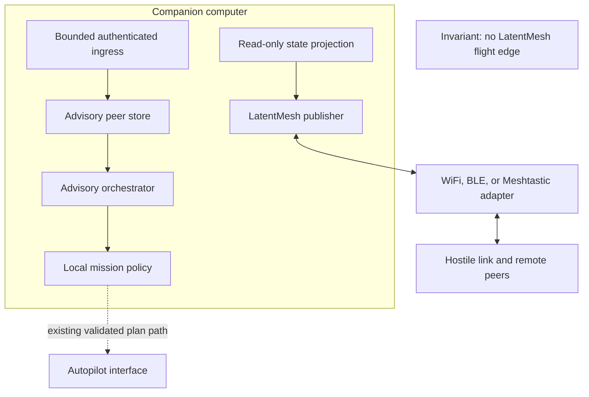
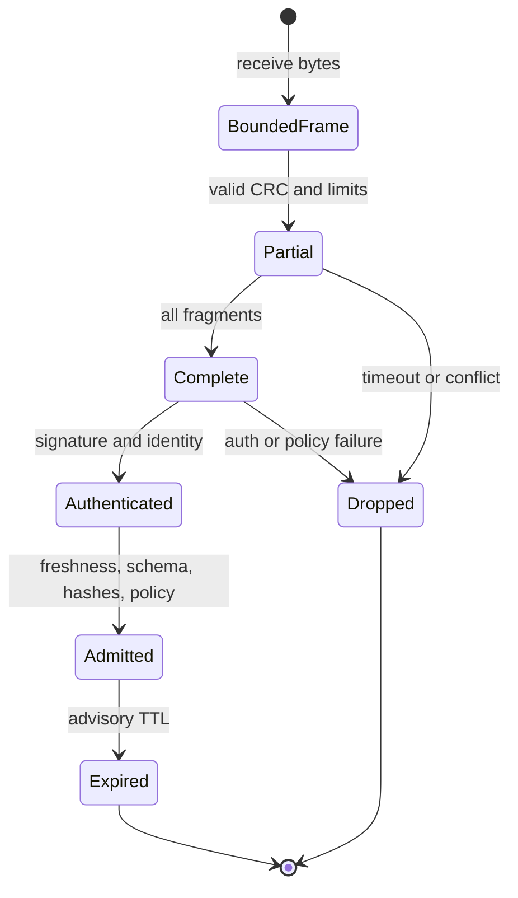

# ADR-173: LatentMesh communications and advisory orchestration plane

| | |
|---|---|
| **Status** | Accepted and implemented behind a disabled-by-default feature |
| **Date** | 2026-09-01 |
| **Deciders** | ruv-drone maintainers |
| **Scope** | Civilian cooperative UAV telemetry and mission orchestration |
| **Security review** | [LatentMesh STRIDE threat model](../security/latentmesh-threat-model.md) |
| **Upstream pin** | `ruvnet/LatentMesh@1ff7332c17798eec3b42da5c6f1c271f355fa806` |

## Decision summary

Integrate `latentmesh-air-core` as an optional, exact-revision dependency and
use its deterministic LMS1/LMAD envelope, fragmentation, state hashing, and
replay primitives for sparse peer-state exchange over WiFi, BLE, and
Meshtastic transport profiles. The integration is a communications and
advisory orchestration plane. It is not a flight-control plane.

The following invariant is absolute:

> LatentMesh has no authority to actuate, arm, disarm, select a flight mode,
> command attitude or velocity, modify a geofence, perform collision
> avoidance, or enter, leave, or override an onboard fail-safe state.

The boundary is structural, not a prompt or confidence threshold. Inbound
state terminates in a separate advisory peer store. The LatentMesh module does
not receive a `FlightController`, command channel, mutable `MeshTopology`,
`FailSafeMachine`, or `Geofence`. A signed message is evidence about a peer. It
is never permission to control a vehicle.

Only deterministic symbolic fields can enter the advisory store. Learned
residuals are optional noncritical evidence in the upstream format. The state
protocol rejects the whole envelope when it contains any residual after
bounded parsing, then records only a suppression counter. It does not accept
the symbolic portion or advance replay state. Residuals never reconstruct,
add, remove, or override a symbolic field. The transport policy can model an
`Observe`-only residual delivery candidate from local causal evidence, but no
residual decoder or state consumer is wired. Enabling even a shadow consumer
requires a new ADR.

## Context

`ruv-drone` already separates cooperative fleet coordination from per-vehicle
flight control. The [`FlightController`](../../src/integration/flight_controller.rs)
trait is the actuation boundary, while local
[`FailSafeMachine`](../../src/failsafe/mod.rs) and
[`Geofence`](../../src/security/geofence.rs) code enforce safety without a
ground-station dependency. LatentMesh adds value where links are intermittent
or bandwidth-constrained: deterministic sparse state, a common envelope across
multiple transports, bounded fragmentation, and explicit state agreement.

The upstream project also states that LatentMesh is a research prototype and
must not be the sole control path for aviation or other safety-critical
communications. This ADR makes that warning an enforced architecture rule,
not merely deployment guidance.

### Desired outcome

1. Exchange authenticated, versioned, deterministic peer observations across
   WiFi, BLE, and Meshtastic profiles.
2. Let orchestration reduce a peer's eligibility for new cooperative work from
   fresh reported battery, link quality, and peer fail-safe state. Any locally
   formed task proposal remains separately manifest-gated and nonbinding.
3. Preserve local autonomy and existing behavior when LatentMesh is absent,
   stale, malformed, jammed, rolled back, or compiled out.
4. Produce enough evidence to diagnose drops, reassembly pressure, replay,
   schema drift, signature failure, and stale advisory data without logging
   keys, raw locations, or payloads.

### Non-goals

The integration does not implement a radio PHY, replace MAVLink or DDS, replace
the autopilot, federate model weights, accept remote executable code, create a
remote command channel, or claim live RF or multi-hop performance. Meshtastic
profile support means the LatentMesh Air wire profile and its frame budget are
accepted. Hardware I/O remains a transport adapter responsibility.

Target acquisition, tracking-to-engage, weapons, countermeasures, and adaptive
behavior in response to threats remain outside the civilian scope described in
[`NOTICE`](../../NOTICE).

### Current research and production boundary

Recent work supports semantic communication as a useful research direction but
does not justify putting a learned channel in flight authority. Lin et al.
evaluate LLM-driven semantic compression for UAV swarms in four 2D simulation
scenario families. Karakasis and Saad simulate a structured latent state with
generative substitution for missing peer messages under link dropout. Both are
research evidence, not production flight-safety evidence. This integration
takes the narrower deployable result: deterministic symbolic state may cross a
sparse semantic channel, while learned residuals remain discardable and have
zero authority.

The separation also follows the real autopilot interface. PX4 Offboard accepts
external position, velocity, attitude, thrust, torque, motor, and servo
setpoints and uses an external-controller liveness stream. PX4 uXRCE-DDS can
carry vehicle information and commands bidirectionally between the flight
controller and companion computer. Those are therefore explicit high-risk
interfaces that the LatentMesh module must not possess, publish to, or
masquerade as.

## Specification

### Actors and inputs

| Actor | Input | Permitted result |
|---|---|---|
| Local state publisher | Read-only local `DroneState` and local fail-safe observation | Signed deterministic state envelope |
| Enrolled peer | Air frames on an enabled profile | Authenticated advisory peer snapshot |
| Transport adapter | Bounded frame bytes | Delivery to a locally configured peer binding that supplies expected source ID and receipt time |
| Advisory orchestrator | Fresh `VerifiedAdvisory` values and a locally approved manifest | Eligibility reduction, a separately policy-gated nonbinding proposal, or no-op |
| Operator | Local peer keys, profile policy, approved manifests, rate and freshness limits | Enable, shadow, canary, disable, approve, or revoke |

### Outputs

* `VerifiedAdvisory`: a private-construction wrapper around immutable,
  source-bound, age-bounded `AdvisoryPeerSnapshot` telemetry and a locally
  constructed `ObserveOnly` security context.
* `ProtocolResult`: an accepted snapshot, pending reassembly, or a typed
  rejection; payload-free counters summarize the outcome.
* Encoded LMS1/LMAD frames for the selected transport profile.
* Aggregate `ProtocolMetrics` and `MetricsSnapshot` values with no raw payload.
  A redacted decision receipt is an optional deployment adapter, not a library
  output in this change.

### Assumptions

* LatentMesh is pinned to commit
  `1ff7332c17798eec3b42da5c6f1c271f355fa806`; an update is a reviewed change
  with golden-vector, threat-model, and compatibility evidence.
* Every production peer has a unique Ed25519 verification key in a local
  allowlist. Test fixture keys are never production defaults.
* A deployment binds each transport endpoint to an expected source ID and
  supplies a monotonic receipt time. The hint is routing evidence only and is
  cryptographically bound to the LMS1 `source_id` after full reassembly. The
  included connected UDP adapter pins one socket peer; the bounded channel is
  for loopback and tests.
* Peer enrollment, key distribution, checkpoint persistence, clock health, and regional RF
  compliance are operator responsibilities outside the Air protocol core.
* Existing flight-control, geofence, collision, and fail-safe behavior remains
  available without this feature.

### Normative requirements

| ID | Requirement |
|---|---|
| LM-001 | The `latentmesh` feature is off by default. Both `default` and no-default-feature builds work without initializing LatentMesh. |
| LM-002 | Every LatentMesh git dependency uses exact `rev = "1ff7332c17798eec3b42da5c6f1c271f355fa806"`; branch and tag selectors are forbidden. |
| LM-003 | Production ingress requires `SIGNED_ENVELOPE`, strict Ed25519 verification, a deployment endpoint-to-expected-source binding, and a local source-to-key binding. CRC32C is corruption detection only. |
| LM-004 | Length, profile, flag, fragment-count, context-count, per-expected-source rate, and message-size limits are checked before proportional allocation or semantic decode. |
| LM-005 | Replay is classified and committed only after complete reassembly, signature verification, outer/body binding, schema/range validation, freshness checks, and exact base/result-hash application. |
| LM-006 | Only schema-versioned `Bool`, `I64`, `U64`, `Q16.16`, and bounded byte fields are admitted. Floating point is range-checked, finite, and quantized before transmission. Unknown or missing fields fail closed. |
| LM-007 | Residuals are never required for state reconstruction. The state protocol rejects the whole envelope when any learned residual is present and increments `MetricsSnapshot::residual_suppressions`; it does not admit the symbolic portion or commit replay. |
| LM-008 | `SemanticClass::Control` is rejected even when correctly signed. Acknowledgements cannot carry state or commands. Telemetry, state-delta, and diagnostic consumers are separated. |
| LM-009 | Accepted peer position, velocity, heading, altitude, battery, link, and fail-safe values remain advisory copies. They are not written into local safety state or any command-producing interface. |
| LM-010 | Transport adapters depend on a byte-oriented semantic transport interface and have no access to `FlightController`. WiFi, BLE, and Meshtastic use the same authenticated envelope and policy pipeline. |
| LM-011 | A sender session epoch, logical sequence, signed snapshot timestamp, transport receipt time, and configured maximum age/future skew are checked. Receiver restart restores a deployment-persisted `ReplayCheckpoint` and requires a keyframe newer than the checkpoint before state returns. |
| LM-012 | Raw frames are dropped after admission, rejection, or reassembly expiry. Private keys, signatures, raw state, and exact coordinates are not logged. Advisory snapshots expire from memory. |
| LM-013 | Payload-agnostic counters cover logical/wire bytes, frame and message counts, CRC, authentication, replay, stale, policy and semantic rejection, reassembly completion/failure, fragment count, and residual suppression. They never retain peer IDs, payloads, signatures, tokens, or keys. |
| LM-014 | Deployment proceeds through disabled, loopback, shadow, canary, and advisory stages. A deployment-owned local lifecycle control stops and drops adapter/session tasks while the existing stack continues; no remote message can enable the feature. |
| LM-015 | No LatentMesh fact alone is sufficient to create a task outside the locally approved mission manifest. The default manifest allowlist is empty; zero is not a valid manifest ID; approval and revocation are local-only. A proposal carries only an opaque manifest ID plus participant, TTL, and effort bounds, with no coordinates, setpoints, or executable body. |

## Architecture

### Deployment topology and trust boundaries



Trust boundary TB1 is between the transport and bounded frame parser. TB2 is
between complete bytes and authenticated semantic admission. TB3 is between
the advisory store and local mission policy. TB4 is the existing autopilot
interface. LatentMesh crosses TB1 through TB3 and stops before TB4.

Each enrolled peer gets a separate reassembly and replay namespace. This is
required because the pinned upstream `Reassembler` keys in-flight data by
`(stream_id, sequence)` and `ReplayWindow` is a sequence window, not a sender
identity store. Sharing one instance across untrusted senders would permit
cross-peer fragment collisions before the envelope exposes `source_id`.

### Components and ownership

| Component | Owns | Explicitly does not own |
|---|---|---|
| `state` projection | Field IDs, Q16.16 conversion, finite/range checks, complete schema | Transport, signatures, task selection |
| publisher | Delta/envelope construction, logical sequence, signing, fragmentation | Private-key persistence, RF scheduling |
| transport adapter | Read/write of complete frame bytes and MTU | Semantic decode, trust, receipt clock, flight commands |
| ingress | Quotas, reassembly lifetime, signature, replay, freshness, schema, hashes | Autopilot, geofence, local fail-safe mutation |
| receiver session | Accepted symbolic snapshot, replay high-water mark, receipt-time TTL | `MeshTopology` safety input, durable raw telemetry |
| `LatentMeshNode` | Protocol/policy/metrics composition and private construction of `VerifiedAdvisory` with private trust fields and `ObserveOnly` authority | Flight or safety handles, remote trust assertions |
| orchestrator advisory map | Newer verified observations and reduce-only peer eligibility | Existing authoritative `peer_states`, task creation, local fail-safe mutation |
| advisory orchestrator | Local-manifest task eligibility and nonbinding proposals | Coordinates, flight mode, velocity, actuation |
| operator policy | Keys, profiles, epochs, limits, rollout mode, revocation | Remote mutation through Air messages |

### Implemented surface and deployment obligations

The `latentmesh` feature implements `state`, `protocol`, `node`, `policy`,
`metrics`, and `transport` modules. `LatentMeshNode` composes signing,
authenticated receive admission, an adaptive delivery policy, and aggregate
counters. It returns `VerifiedAdvisory`, whose fields are private and whose
security context has private trust fields and is constructed locally as
authenticated, trusted, and `ObserveOnly`. Public library consumers can read
that context but cannot mint or elevate it. `SwarmOrchestrator` stores that value in
`latentmesh_advisories`, never `peer_states`; its only current consumer is a
freshness/battery/link/fail-safe predicate that can make a remote peer
ineligible for new cooperative work. Expiry removes the advisory.

`CapabilityGate` and `AdaptivePolicy` implement local approve/revoke of opaque
manifest IDs, bounded nonbinding proposals, traffic scheduling, energy/link
limits, and categorical rejection of flight/actuator actions. The inbound
state protocol does not decode remote `RequestedAction` values, so a verified
telemetry envelope cannot manufacture a proposal or an authenticated policy
context.

The included transports are a bounded in-process datagram loopback and a
connected UDP datagram adapter. WiFi, BLE, and Meshtastic support here means
wire-profile selection and frame budgeting; production radio/BLE/Meshtastic
I/O, endpoint-to-source configuration, lifecycle control, key storage,
`ReplayCheckpoint` persistence, RF compliance, and optional audit export
remain deployment responsibilities. The checked-in `Cargo.lock` and CI's
`--locked` build, test, feature-test, and clippy commands make dependency
resolution reproducible.

### Field-consumer contract

The deterministic schema can faithfully carry values that are safety-relevant
at their source without granting those copies safety authority at the
receiver. The consumer contract is stricter than the serializer contract.

| Field group | Allowed receiver consumer | Forbidden use |
|---|---|---|
| schema, node, sender epoch, timestamp | Admission and optional redacted audit | Identity without key binding |
| position, velocity, heading, altitude | UI, recording policy, shadow analytics | Collision avoidance, geofence, attitude or velocity commands |
| battery and link quality | Reduce remote peer task eligibility, observability | Local return-to-home, arming, or fail-safe transition |
| reported peer fail-safe state | Display and peer availability reduction | Entering or clearing any local fail-safe state |
| residual slots | Reject envelope and increment suppression counter | Any symbolic field or task/plan decision |

`PeerState` is therefore a wire-compatible observation type. Conversion to a
`DroneState` value is a serialization convenience, not a grant to insert it
into the authoritative topology or local safety state.

### Wire and resource budgets

The pinned Air core limits a frame to 256 bytes, a message to 32 fragments,
critical state to 64 fields, symbolic bytes to 32 per field, residuals to 16,
and residual values to 64 per slot. This integration narrows the default
message limit to 4,096 bytes and uses at most four in-flight contexts per
enrolled peer. The default enrollment cap is 32 peers, so incomplete payload
storage is bounded to 512 KiB, excluding small container overhead:

`32 peers * 4 contexts * 4,096 bytes = 524,288 bytes`.

The hard configured peer cap is 256. Raising the default requires a memory
budget review. Contexts expire rather than evicting an authenticated in-flight
message silently. New work is rejected with a stable `reassembly_full` reason
when a peer reaches its cap.

| Profile | Frame MTU | Partial-message default expiry | Fresh advisory maximum age | Scheduling rule |
|---|---:|---:|---:|---|
| WiFi | 256 bytes | 2 seconds | 5 seconds | Per-peer fixed window, default 128 frames/s |
| BLE | Configured 16 to 256 bytes | 5 seconds | 30 seconds | Locally configured fixed window, recommended 16 frames/s |
| Meshtastic | 227 bytes | 10 minutes | 15 minutes | Adapter-provided regional airtime budget; no fixed-rate assumption |

The code default is the WiFi row: 32 peers, four contexts per peer, 4,096 bytes
per message, 128 frames per one-second source window, 2-second reassembly
timeout, 5-second snapshot age, 500 ms future skew, and 5-second advisory TTL.
BLE and Meshtastic are explicit local `RxConfig` profiles rather than implicit
runtime guesses.

The Meshtastic 227-byte value is source-backed for the pinned upstream adapter
and leaves 211 bytes after the 16-byte Air frame overhead. It was validated by
upstream against `meshtasticd` 2.7.26 with a simulated radio, not over RF.
WiFi and BLE values are integration configuration limits, not measured link
performance. Transport latency and RF delivery are outside the local codec
budget.

### Identity, keying, and freshness

Production uses Ed25519 signatures over
`SemanticEnvelope::authentication_bytes()`. `source_id`, sender epoch,
message ID, logical sequence, state hash, class, priority, and the semantic body
are therefore bound by the signature. The built-in registry maps one source ID
to one active verification key. A separate `RxConfig` instance fixes the
allowed wire profile, while the deployment binds its transport endpoint to the
`expected_source_id` supplied at ingress. Meshtastic channel encryption or
WiFi/BLE link security can add confidentiality but never substitutes for the
envelope signature.

Private keys use the `EnvelopeSigner` seam, with a software `SigningKey`
adapter for tests and deployments that explicitly accept in-process key
storage. An OS keystore or HSM adapter can implement the same seam and owns
zeroization where supported. Keys are not accepted over a LatentMesh message
and are not shared with MAVLink signing. The built-in peer registry has one
active verification key per source, so rotation is an explicit cutover, not a
permissive overlap. A deployment using the built-in value registry reconstructs
the receive session from the persisted replay checkpoint when replacing or
removing a key; a dynamic external `TrustedPeerKeyLookup` may provide an atomic
local cutover. Neither path accepts key changes over LatentMesh.

The 16-bit frame sequence prevents short-window replay; the signed 64-bit
logical sequence and sender epoch prevent authority reset at wrap or restart.
The receiver exports `ReplayCheckpoint { source_id, epoch,
last_logical_sequence, last_timestamp_ms }` values for durable deployment
storage. On restore it retains the high-water mark but no advisory state, so a
signed full keyframe with a later logical sequence in the same epoch, or a
greater epoch starting at sequence zero, is mandatory before state returns. A
stale epoch or nonzero/non-keyframe new-epoch start fails closed. A base-hash
mismatch waits for the periodic signed keyframe; it never applies a best-effort
merge. The transmitter default emits a keyframe every 16 messages.

### Data lifecycle



Raw transport bytes live only through parsing or bounded reassembly. A
successful admission stores the symbolic state and advisory snapshot, receipt
time, sender epoch, logical sequence, timestamp high-water, and replay window.
It does not store
the signature, raw envelope, residuals, or RF samples. The library exposes
typed errors and payload-agnostic counters rather than retaining rejection
payloads. A deployment audit adapter may record a redacted decision receipt.
Snapshot TTL removal is deterministic and does not alter local vehicle state.

### Observability

`ProtocolMetrics` implements `frames_seen`, `completed_envelopes`,
`accepted_snapshots`, and CRC, authentication, replay, and semantic rejection
counters. `LatentMeshMetrics` separately implements sent/received messages,
logical/wire bytes, authentication/replay/stale/policy drops, reassembly
completion/failure and fragment count, and residual suppression. Both use
saturating counters and retain no payload or peer context. Deployment exporters
may map these fields to prefixed metric names, but must not add source ID,
coordinates, keys, signatures, or message IDs as labels.

## Pseudocode

### Publish path

```text
deployment_publish(read_only_local_state, profile, endpoint_running):
    require endpoint_running is controlled locally
    require profile is locally enabled
    symbolic = project_complete_schema(read_only_local_state)
    require every numeric source is finite and in range
    quantized = convert_floats_to_q16_16(symbolic)
    delta = deterministic_delta(previous_sent_state, quantized, residuals = [])
    envelope = LMS1(delta, source_id, sender_epoch, next_logical_sequence)
    signature = EnvelopeSigner.sign_envelope(envelope.authentication_bytes)
    frames = fragment(envelope + signature, profile_mtu)
    require frames and bytes fit local token and airtime budgets
    transmitter commits previous_sent_state and sequence after encode/fragment succeeds
    transport.send(frames)
    if datagram delivery fails: do not infer remote state; periodic keyframe repairs the chain
```

### Receive path

```text
receive(expected_source_id, receipt_time, raw_frame):
    require deployment endpoint is running and locally bound to expected_source_id
    frame = decode_with_fixed_bounds_and_crc(raw_frame)
    require frame.profile equals adapter profile
    require frame flags equal configured flags plus SIGNED_ENVELOPE
    require frame stream equals stream_id_for_source(expected_source_id)
    require expected_source_id has a trusted key
    expire contexts older than reassembly_timeout
    require receipt clock monotonic and per-source fixed-window rate below cap
    partial = per_source_bounded_reassembly.push(frame, receipt_time)
    if incomplete: return Pending

    envelope = decode_bounded(partial.complete_bytes)
    require envelope source equals expected_source_id
    require outer class, priority, state tag, stream, sequence, and message ID agree
    require envelope signature is present
    require verify_strict(source_key, envelope.authentication_bytes, signature)
    delta = decode_canonical_symbolic_delta(envelope.body)
    require delta.residuals is empty; otherwise reject and count suppression
    require sender epoch/keyframe rules and logical sequence are fresh
    require exact known schema, complete fields, types, and domain ranges
    next_state = delta.apply(exact_cached_base)
    require next_state hash equals signed result hash
    require signed state timestamp is monotonic and within age/future-skew limits
    advisory = project_to_non_authoritative_peer_state(next_state)

    within the receiver's exclusive mutable admission call:
        commit replay only now
        replace advisory snapshot and high-water marks
    emit accepted metrics without payload or peer label
    facade constructs private VerifiedAdvisory with local ObserveOnly context
    return VerifiedAdvisory
```

A separate proposal gate begins with an empty manifest allowlist. A cooperative
proposal is eligible only when its nonzero opaque `manifest_id` has been added
locally and its participant count, TTL, and effort are within local bounds.
Remote state has no method to approve or revoke a manifest.

### Success walk-through

1. Enrolled peer 7 sends a signed WiFi state delta in two fragments.
2. Both frames pass fixed bounds and CRC. The first creates one bounded context;
   no replay state or advisory state changes.
3. The second completes the envelope. Strict signature, peer/source binding,
   class, schema, sender epoch, age, logical sequence, and base/result hashes
   pass. Residual count is zero.
4. Under the peer lock, replay is rechecked and committed with the new advisory
   snapshot. No flight-controller method is called.
5. The orchestrator may mark peer 7 unavailable if its reported battery band is
   low. It cannot command peer 7 or the local vehicle from that report.

Every invariant remains true: authentication precedes exposure, replay commits
after full admission, state is deterministic, and the only output is advisory.

### Failure walk-through

An enrolled but compromised peer sends a validly signed `Control` envelope,
fragmented to hold receiver memory, and labels its body as an emergency velocity
change. Per-source quotas limit it to four contexts and 128 frames in the
default one-second window. Once complete, delta unwrapping rejects the class
before semantic application. No replay commit, advisory update, task proposal,
fail-safe transition, or flight-controller call occurs. The completed context
is removed and the typed rejection contributes only payload-free rejection
counters; local safety behavior continues unchanged.

## Alternatives and quantified trade-offs

The figures below are engineering estimates for one experienced Rust engineer
and local processing targets, not measured network performance. Risk is a
relative 1 to 5 scale after the stated design, where 5 is highest. Network
latency is dominated by the selected transport and is deliberately excluded.

| Alternative | Delivery estimate | Local encode/admit target, p99 | Typical payload | Residual safety/security risk | Decision |
|---|---:|---:|---:|---:|---|
| Separate LatentMesh advisory plane, selected | 7 to 12 engineer-days | Local release microbench: 39.2 microseconds sign/fragment and 49.6 microseconds reassemble/verify/admit at 64-byte MTU | Local full keyframe: 292 logical and 404 wire bytes; upstream one-field delta shape: about 184 to 186 wire bytes | 2 | Selected: bounded multi-profile semantics without control authority |
| Add authentication and freshness to existing serde gossip | 3 to 6 engineer-days | less than 1 ms | Estimated 400 to 1,200 bytes for JSON-shaped full telemetry | 3 | Lower initial cost, but duplicates wire, fragmentation, replay, and schema work |
| Add custom MAVLink extension messages | 6 to 10 engineer-days | less than 1 ms | Usually constrained to MAVLink message sizing and dialect | 5 | Rejected: couples orchestration data to the flight-control transport boundary |
| Feed learned LatentMesh residuals into planning | 15 to 30 engineer-days plus model evidence | 2 to 10 ms plus inference | Model-dependent | 5 | Rejected: opaque residuals have no acceptable authority path or validated benefit here |
| No integration | 0 | 0 | 0 | 1 technical, 5 opportunity | Rejected: no common sparse semantic layer for constrained links |

At five updates per second, a 186-byte frame from each of 20 peers is about
18.6 KB/s before transport overhead and retransmission. That is an arithmetic
planning example, not a promised rate. Meshtastic must use its adapter-provided
airtime budget and is never scheduled at the WiFi example rate.

## Rollout and rollback

1. **Disabled:** feature not compiled, or no LatentMesh adapter/session task is
   started by the deployment. Existing behavior is the baseline and acceptance
   oracle.
2. **Loopback:** deterministic golden vectors, malformed input, replay,
   fragmentation, and policy tests only.
3. **Shadow receive:** real transport bytes may be decoded and measured, but no
   advisory snapshot is visible to orchestration.
4. **Canary advisory:** one ground node and at most two vehicles expose fresh
   snapshots to UI and availability reduction. No task proposals are enabled.
5. **Fleet advisory:** locally approved task proposals can consume permitted
   fields after the canary error budget has remained within policy for the
   declared evaluation window.

Rollback stops the local adapter/session tasks, drops their reassembly
contexts and advisory snapshots, and leaves the existing transport,
orchestrator, topology, geofence, fail-safe, and flight controller unchanged.
It does not require an on-air message or a peer acknowledgement. Dependency
rollback reverts the exact-revision Cargo change and lockfile together.

Automatic rollback triggers include any command-interface call attributable to
LatentMesh, any accepted unsigned or wrong-key message, replay acceptance,
unbounded memory growth, or a state-hash mismatch admitted as success. These
are zero-tolerance invariants, not error-budget events.

## Acceptance tests and requirements trace

The commands are run from repository root. Tests using production hardware are
separate release evidence and are not implied by these local checks.

| Test | Exact procedure and expected result | Requirements |
|---|---|---|
| AT-001 default isolation | `cargo test --locked --no-default-features --all-targets` exits 0; `cargo tree --locked --no-default-features` contains no `latentmesh-air-core` or `ed25519-dalek`. | LM-001, LM-014 |
| AT-002 pinned dependency | `cargo metadata --locked --format-version 1` reports the LatentMesh git source ending `rev=1ff7332c17798eec3b42da5c6f1c271f355fa806`; no branch/tag selector exists in `Cargo.toml`, and the reviewed `Cargo.lock` is tracked. | LM-002 |
| AT-003 feature suite | `cargo test --locked --features latentmesh --all-targets` exits 0 and `cargo clippy --locked --features latentmesh --all-targets -- -D warnings` exits 0. | LM-001 through LM-015 |
| AT-004 authenticated round trip | Build a complete schema, sign it with the enrolled fixture key, fragment it for each of WiFi, BLE, and Meshtastic, deliver fragments out of order, and assert one byte-equivalent advisory snapshot plus no command call. | LM-003, LM-005, LM-006, LM-009, LM-010 |
| AT-005 identity failures | For unsigned, wrong-key, source/key mismatch, profile mismatch, and altered signed-body cases, assert a stable rejection, zero replay commit, zero snapshot update, and zero flight-controller calls. | LM-003, LM-008, LM-009 |
| AT-006 replay ordering | Deliver fragment 0 twice, complete the message, then replay every fragment. Assert duplicate in-flight data is idempotent, exactly one post-admission replay commit occurs, and the completed replay is rejected only after safe bounded reassembly. | LM-005 |
| AT-007 bounded hostile input | Fuzz lengths 0 through 8,192, fragment counts 0 through 255, conflicting duplicate fragments, 5 contexts for one peer, and 33 fragments. Peak configured payload storage stays at or below 16,384 bytes for that peer; every excess case fails closed. | LM-004, LM-012 |
| AT-008 freshness and restart | Test expired receipt age, excessive future skew, decreasing timestamp, old logical sequence, stale/decreasing sender epoch, nonzero or non-keyframe new-epoch start, 16-bit wrap, and receiver restart with a restored high-water mark. None updates the snapshot; the next later same-epoch signed keyframe or a greater epoch at logical sequence zero with a complete keyframe is accepted once. | LM-005, LM-011 |
| AT-009 schema and residual separation | Test NaN, infinity, out-of-range Q16.16, missing/unknown/wrong-type fields, wrong base/result hash, and an otherwise valid signed delta with maximal residuals. Invalid symbolic state and the residual-bearing envelope are rejected, no snapshot changes, and the suppression count rises. | LM-006, LM-007 |
| AT-010 authority seam | Run `cargo test --locked --features latentmesh every_flight_or_actuator_action_is_categorically_rejected`, `cargo test --locked --features latentmesh cooperative_proposals_require_a_locally_approved_manifest`, `cargo test --locked --features latentmesh verified_observation_still_cannot_request_flight_action`, and `cargo test --locked --features latentmesh test_latentmesh_advisory_is_reduce_only_and_not_safety_topology`. All exit 0: forbidden actions reject; only a locally approved nonzero manifest yields the bounded nonbinding capability; verified telemetry remains outside `peer_states`; local safety is unchanged. | LM-008, LM-009, LM-015 |
| AT-011 expiry and rollback | Hold partial messages past each configured timeout, expire accepted snapshots, then stop and drop the adapter/session tasks. Context, snapshot, and publish queues reach zero without a peer message; the existing default test suite still passes. | LM-004, LM-011, LM-012, LM-014 |
| AT-012 observability privacy | Exercise authentication, replay, stale, policy, semantic, reassembly, and residual-suppression cases and inspect `ProtocolMetrics`, `MetricsSnapshot`, and debug output. Required counters change and no payload, signature, source ID, coordinate, token, or key bytes are retained. | LM-012, LM-013 |

### Performance and hardware release gates

`benches/latentmesh_bench.rs` is committed as reproducible local evidence. On
an Intel Xeon Platinum 8573C container with Rust 1.98.0, 20-sample Criterion
runs measured 386.62 to 397.98 ns for state projection, 38.677 to 39.616
microseconds for signing plus fragmentation, and 47.952 to 51.988 microseconds
for reassembly plus signature verification and admission at 64-byte MTU. The
loopback example measured a 292-byte signed full keyframe carried as seven
64-byte-MTU fragments and 404 total wire bytes.

The hardware release gate must additionally report p50, p95, p99, peak
allocation, frame size, and fragment count on a named flight computer. The
acceptance target remains p99 below 2 ms for one 256-byte frame and no
allocation above configured bounds. The local Criterion confidence intervals
are not tail percentiles and do not satisfy that hardware gate.

WiFi, BLE, or Meshtastic production claims additionally require two physical
peers, declared firmware and hardware identities, packet delivery and latency
distributions, loss and reordering cases, legal radio configuration, and a
tested disable path. The pinned LatentMesh Meshtastic evidence used a real
firmware process with a simulated radio and does not satisfy an over-the-air
gate.

## Consequences

### Positive

* One deterministic, authenticated semantic contract spans three transport
  profiles without coupling those transports to the autopilot.
* State hashes and canonical fixed-point fields make divergence and schema
  drift detectable.
* Failure is loss of advisory coordination, not loss of local vehicle safety.
* Exact dependency pinning and staged rollout make change and rollback
  reviewable.

### Costs and residual risks

* Per-peer reassembly, replay persistence, key provisioning, and resync add
  operational state.
* Signatures provide authenticity, not confidentiality. Exact location and
  mission privacy still depend on transport security and data minimization.
* A compromised enrolled peer can lie about its own advisory state. Local
  manifests, reduce-only eligibility, range checks, and key revocation limit
  impact but cannot make the report true.
* Meshtastic latency and duty-cycle limits make it suitable for sparse status,
  not real-time formation or safety telemetry.
* The largest failure mode is accidental wiring of `PeerState` into existing
  authoritative `MeshTopology` or safety inputs. The fix path is a type-level
  advisory wrapper, private fields, dependency-direction tests, and a zero-call
  mock flight-controller acceptance test.

## Source provenance and evidence grades

The design was checked against local source at these immutable repository
states:

* `ruv-drone` baseline
  [`cfe8b662bd648e9ea19a4047275dfce2c5c8e699`](https://github.com/ruvnet/ruv-drone/commit/cfe8b662bd648e9ea19a4047275dfce2c5c8e699).
* LatentMesh pin
  [`1ff7332c17798eec3b42da5c6f1c271f355fa806`](https://github.com/ruvnet/LatentMesh/commit/1ff7332c17798eec3b42da5c6f1c271f355fa806).
* Air frame/profile constants and CRC checks:
  [`wire.rs`](https://github.com/ruvnet/LatentMesh/blob/1ff7332c17798eec3b42da5c6f1c271f355fa806/crates/latentmesh-air-core/src/wire.rs).
* Bounded fragmentation and reassembly:
  [`fragment.rs`](https://github.com/ruvnet/LatentMesh/blob/1ff7332c17798eec3b42da5c6f1c271f355fa806/crates/latentmesh-air-core/src/fragment.rs).
* Signed envelope and canonical authentication bytes:
  [`envelope.rs`](https://github.com/ruvnet/LatentMesh/blob/1ff7332c17798eec3b42da5c6f1c271f355fa806/crates/latentmesh-air-core/src/envelope.rs).
* Deterministic state, Q16.16, state hashes, and residual separation:
  [`semantic.rs`](https://github.com/ruvnet/LatentMesh/blob/1ff7332c17798eec3b42da5c6f1c271f355fa806/crates/latentmesh-air-core/src/semantic.rs).
* Replay window and post-reassembly commit rule:
  [`replay.rs`](https://github.com/ruvnet/LatentMesh/blob/1ff7332c17798eec3b42da5c6f1c271f355fa806/crates/latentmesh-air-core/src/replay.rs).
* Upstream receive admission ordering:
  [`receiver.rs`](https://github.com/ruvnet/LatentMesh/blob/1ff7332c17798eec3b42da5c6f1c271f355fa806/crates/latentmesh-air-radio/src/receiver.rs).
* Meshtastic adapter and 227-byte budget:
  [`adapter.rs`](https://github.com/ruvnet/LatentMesh/blob/1ff7332c17798eec3b42da5c6f1c271f355fa806/crates/latentmesh-meshtastic/src/adapter.rs)
  and upstream
  [ADR-019](https://github.com/ruvnet/LatentMesh/blob/1ff7332c17798eec3b42da5c6f1c271f355fa806/docs/adr/019-meshtastic-transport-adapter.md).
* Prototype safety boundary and threat invariants:
  [`SECURITY.md`](https://github.com/ruvnet/LatentMesh/blob/1ff7332c17798eec3b42da5c6f1c271f355fa806/SECURITY.md).
* Flight-authority boundary: PX4
  [Offboard Mode](https://docs.px4.io/main/en/flight_modes/offboard) and
  [uXRCE-DDS bridge](https://docs.px4.io/main/en/middleware/uxrce_dds).
* Existing autopilot-link authentication precedent:
  [MAVLink 2 message signing](https://mavlink.io/en/guide/message_signing.html).
* Research context only: Lin et al.,
  [*Talk Less, Fly Lighter*](https://arxiv.org/abs/2508.12043), based on 2D
  simulations; and Karakasis and Saad,
  [*Latent Semantic State Estimation for Reliable Swarming of UAVs under
  Intermittent Connectivity*](https://arxiv.org/abs/2608.08895), based on
  simulation.

Code constants and behavior above are primary-source evidence. Delivery time,
local latency targets, memory configuration, rollout thresholds, and transport
freshness defaults are ruv-drone design decisions or estimates and are labeled
as such. No live RF, aviation certification, or production-hardening claim is
made by this ADR.
