# LatentMesh user guide

LatentMesh is an optional authenticated communications and advisory
orchestration plane for `ruv-drone`. It exchanges compact peer state across
WiFi, BLE, and Meshtastic wire profiles without giving the network access to
flight control.

For a visual introduction, open the
[interactive ruv-drone LatentMesh explainer](https://latentmesh-flight-safe-mesh.ruv.chatgpt.site).
For the complete design rationale and threat analysis, read
[ADR-173](./adr/ADR-173-latentmesh-comms-orchestration.md) and the
[LatentMesh threat model](./security/latentmesh-threat-model.md).

## Safety contract

Treat every accepted peer message as an authenticated observation, not a
command. A valid signature proves which enrolled key signed the message. It
does not prove the peer is physically healthy, correctly localized, or honest.

LatentMesh may:

1. Publish deterministic local state as signed advisory telemetry.
2. Verify and expose fresh peer state in a separate advisory store.
3. Reduce a peer's eligibility for new cooperative work.
4. Evaluate transport priority, acknowledgement, redundancy, and suppression.
5. Propose bounded cooperative work that references a locally approved
   mission manifest.

LatentMesh must never:

1. Arm or disarm a vehicle.
2. Change a flight mode.
3. Publish attitude, rate, velocity, or position setpoints.
4. Override a geofence or local fail-safe.
5. Release a payload.
6. Enter peer state into authoritative collision avoidance or topology state.
7. Treat learned residuals as flight or mission evidence.

The public `LatentMeshNode` facade owns no `FlightController`, `MeshTopology`,
geofence, actuator, or fail-safe mutation handle. Preserve that dependency
direction in every adapter.

```mermaid
flowchart LR
    Local["Local drone state"] --> Encode["Canonical Q16.16 state"]
    Encode --> Sign["Signed envelope"]
    Sign --> Link["Bounded radio frames"]
    Link --> Verify["Verify and admit"]
    Verify --> Advisory["Expiring advisory"]
    Advisory --> Policy["Local mission policy"]
    Policy -. "no control path" .-> Flight["Flight controller"]
```



## 1. Enable and verify the feature

The feature is off by default. The normal build does not resolve or compile
LatentMesh.

```bash
cargo build --locked
cargo build --locked --features latentmesh
cargo test --locked --features latentmesh --all-targets
cargo clippy --locked --features latentmesh --all-targets -- -D warnings
```

The upstream Air contract is pinned to the reviewed LatentMesh revision in
`Cargo.toml`. Update that revision and `Cargo.lock` together, then repeat the
protocol, security, and hardware validation gates before deployment.

## 2. Run the authenticated loopback

```bash
cargo run --locked --features latentmesh --example latentmesh_loopback
```

Expected shape:

```text
source=7 sequence=0 fragments=7 logical_bytes=292 wire_bytes=404 battery=82.0% authority=ObserveOnly
```

The example in [`examples/latentmesh_loopback.rs`](../examples/latentmesh_loopback.rs)
creates two peers with enrolled Ed25519 verification keys, signs local drone
state, fragments it at a 64-byte MTU, sends it through a bounded Tokio channel,
reassembles it, verifies it, and returns a `VerifiedAdvisory`.

The literal in-process signing keys are test fixtures. Do not reuse them.

## 3. Provision identity locally

Each source ID maps to one active Ed25519 verification key. Bind these three
values in deployment configuration:

1. Transport endpoint or radio identity.
2. Expected `source_id`.
3. Enrolled verification key.

Construct `TrustedPeerKeys` from a local protected configuration source. Never
accept a key change, peer enrollment, or source mapping from a LatentMesh
message.

For development, `ed25519_dalek::SigningKey` implements `EnvelopeSigner`.
Production systems should implement the same signer seam with an OS keystore,
secure element, or HSM. The implementation must own key zeroization and must
not share signing material with MAVLink.

Key rotation is an explicit local cutover. The built-in registry accepts one
active key per source, so it does not create a permissive overlap window.

## 4. Select a wire profile

`TxConfig::default()` and `RxConfig::default()` select the WiFi profile.
BLE and Meshtastic require explicit local configuration. Do not infer a wire
profile from untrusted frames.

| Profile | Complete frame MTU | Partial message expiry | Fresh snapshot ceiling | Scheduling policy |
|---------|-------------------:|-----------------------:|-----------------------:|-------------------|
| WiFi | 256 bytes | 2 seconds | 5 seconds | 128 frames per one-second peer window by default |
| BLE | Configured 16 to 256 bytes | 5 seconds | 30 seconds | Local fixed window, 16 frames per second recommended |
| Meshtastic | 227 bytes | 10 minutes | 15 minutes | Adapter supplied regional airtime budget |

The 227-byte Meshtastic budget leaves 211 bytes after the Air frame overhead.
It is suitable for sparse status, not formation control, collision avoidance,
or real-time safety telemetry.

WiFi, BLE, or Meshtastic encryption may add confidentiality. It never replaces
the semantic envelope signature. Coordinates and mission details still require
data minimization and transport privacy appropriate to the deployment.

## 5. Publish local state

Create one transmit session per local identity and sender epoch. The source ID
must match `DroneState.id`.

```rust
use ed25519_dalek::SigningKey;
use ruview_swarm::latentmesh::{LatentMeshTxSession, TxConfig};

let signer = SigningKey::from_bytes(&local_test_key);
let mut tx = LatentMeshTxSession::new(source_id, sender_epoch, signer, TxConfig::default())?;
let batch = tx.encode_advisory_state(&drone_state, &failsafe_state)?;

for frame in batch.encoded_frames()? {
    transport.send_frame(&frame).await?;
}
```

The transmitter:

1. Rejects nonfinite or out-of-range source state.
2. Converts values to the canonical Q16.16 schema.
3. Emits a deterministic delta and signed result hash.
4. Produces a complete keyframe every 16 messages by default.
5. Commits transmit state only after encoding and fragmentation succeed.

A failed datagram send does not imply remote delivery. The periodic keyframe
repairs a lost delta chain without a best-effort merge.

## 6. Receive and admit peer state

Use a locally configured `expected_source_id` for every ingress endpoint. Do
not copy that value from the incoming frame.

```rust
while let Ok(frame) = transport.receive_frame().await {
    match node.ingest_frame_bytes(expected_source_id, monotonic_now_ms(), &frame) {
        Ok(Some(verified)) => {
            let peer = &verified.received().snapshot;
            advisory_store.replace(peer.clone());
        }
        Ok(None) => {
            // More bounded fragments are required.
        }
        Err(error) => {
            record_typed_drop(error);
        }
    }
}
```

Admission verifies fixed bounds, CRC32C, profile and source binding, fragment
agreement, enrolled key, strict Ed25519 signature, schema, state hashes,
sender epoch, signed logical sequence, replay window, ranges, age, and future
skew. The receiver rejects the whole envelope if it contains learned
residuals.

Replay state and advisory state commit together only after every check passes.
A rejected complete message does not consume the logical sequence.

## 7. Consume advisory state safely

`VerifiedAdvisory` has private fields. A radio payload or general library
consumer cannot construct trusted context or raise its authority.

Permitted consumers include:

1. UI and ground-station displays.
2. Redacted recording and shadow analytics.
3. Payload-free operational metrics.
4. A reduce-only peer eligibility filter for new cooperative work.

Do not convert `ReceivedAdvisorySnapshot` into authoritative `DroneState`, add
it to `MeshTopology`, use it for collision avoidance, or allow it to trigger or
clear a local fail-safe.

If a peer reports low battery, weak link, or a fail-safe, the local
orchestrator may stop offering that peer new work. It may not change the peer's
flight behavior.

## 8. Gate cooperative proposals

The capability gate starts with an empty manifest allowlist. A remote peer
cannot add to or remove from it.

```rust
let manifest_id = 0xA17;
assert!(node.approve_manifest(manifest_id));

// Evaluate bounded proposal intent through AdaptivePolicy.

assert!(node.revoke_manifest(manifest_id));
```

A proposal is eligible only when all of these conditions hold:

1. The opaque, nonzero manifest ID was approved locally.
2. The participant count is between 1 and the local maximum.
3. The proposal TTL and effort are positive and within local ceilings.
4. The authenticated context is fresh and observe-only.
5. The requested action is a nonbinding cooperative proposal.

The default ceilings are 64 participants, 60 seconds, and 10,000 deployment
defined effort units. These are admission limits, not mission recommendations.

## 9. Persist replay checkpoints

Persist `node.replay_checkpoints()` in durable local deployment state at a
controlled cadence and on clean shutdown. Restore each checkpoint before
exposing received advisory state after restart.

```rust
for checkpoint in load_replay_checkpoints()? {
    node.restore_replay_checkpoint(checkpoint)?;
}
```

Restore retains the sequence and timestamp high-water mark but no advisory
snapshot. The sender must provide either:

1. A later signed full keyframe in the same epoch.
2. A greater sender epoch that starts at logical sequence zero with a keyframe.

Never decrease an epoch or checkpoint to recover connectivity. That converts
an availability problem into replay exposure.

## 10. Operate within fixed resource budgets

Default receive limits are:

| Resource | Default |
|----------|--------:|
| Enrolled peers | 32 |
| In-flight contexts per peer | 4 |
| Complete message size | 4,096 bytes |
| Fragments per message | 32 maximum from Air core |
| Frames per one-second peer window | 128 |
| Reassembly timeout | 2 seconds |
| Maximum snapshot age | 5 seconds |
| Accepted future skew | 500 milliseconds |
| Advisory TTL | 5 seconds |

Incomplete payload storage is bounded to approximately 512 KiB at the default
peer and context limits, excluding small container overhead. Raising the
default peer cap requires a memory budget review. The hard configured peer cap
is 256.

Call `node.expire_stale(now_ms)` regularly. Expiry removes reassembly contexts
and advisory data without changing local vehicle state.

## 11. Export safe metrics

`node.metrics().snapshot()` exposes saturating counters for sent and received
messages, logical and wire bytes, authentication, replay, stale and policy
drops, reassembly outcomes, fragment totals, and residual suppression.

Do not add source IDs, coordinates, keys, signatures, message IDs, or raw
payload data as metric labels. High-cardinality peer labels also increase cost
and can leak mission topology.

Recommended alerts:

| Signal | Meaning | Response |
|--------|---------|----------|
| Authentication drops increase | Wrong key, wrong source binding, or forgery | Isolate endpoint and verify enrollment |
| Replay drops increase | Duplicate delivery or replay attempt | Inspect transport duplication and checkpoint state |
| Stale drops increase | Clock drift, delayed link, or lost keyframe chain | Verify monotonic time and sender epoch |
| Reassembly failures increase | Loss, conflict, timeout, or wrong MTU | Reduce traffic and inspect profile configuration |
| Residual suppression is nonzero | Unsupported learned data reached admission | Stop sender and correct schema policy |

## 12. Deploy in stages

1. **Disabled.** Do not compile the feature, or start no LatentMesh task.
2. **Loopback.** Run deterministic protocol, malformed input, replay, and
   policy tests.
3. **Shadow receive.** Decode real bytes and export counters, but expose no
   advisory to orchestration.
4. **Canary advisory.** Use one ground node and at most two vehicles. Allow UI
   and reduce-only availability, with no task proposals.
5. **Fleet advisory.** Permit locally approved task proposals only after the
   canary error budget remains inside deployment policy.

Rollback stops the local adapter and session tasks, drops reassembly contexts
and advisory snapshots, and leaves the existing transport, topology, geofence,
fail-safe, orchestrator, and flight controller unchanged. It requires no radio
message or peer acknowledgement.

Automatic rollback conditions are zero tolerance:

1. Any flight-controller call attributable to LatentMesh.
2. Acceptance of an unsigned or wrong-key message.
3. Acceptance of a replay.
4. Unbounded memory growth.
5. Admission of a state-hash mismatch.

## 13. Complete the hardware release gate

Software validation is necessary but not enough. Before a production claim,
run two physical nodes on the intended radio, operating system, CPU, key store,
and regional configuration.

Record at least:

1. End-to-end latency at p50, p95, and p99.
2. Peak and steady-state allocations.
3. Packet loss, duplication, corruption, and reordering behavior.
4. Keyframe recovery after dropped deltas.
5. Restart recovery from persisted replay checkpoints.
6. Clock drift and future-skew rejection.
7. Key provisioning, protected signing, rotation, and revocation.
8. Local disable and rollback behavior.
9. Radio duty cycle and regional compliance.

Acceptance requires all messages to remain advisory, all malformed or
unauthorized inputs to fail closed, resource use to remain within the declared
budget, and stopping LatentMesh to leave normal `ruv-drone` flight and safety
behavior unchanged.
