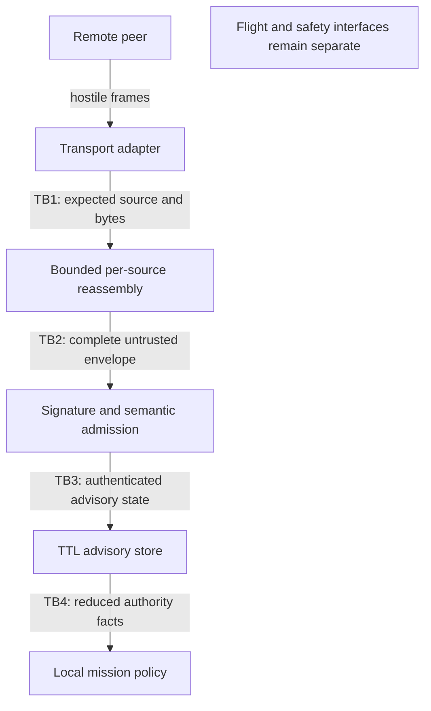

# LatentMesh communications threat model

| | |
|---|---|
| **System** | `ruv-drone` LatentMesh communications and advisory orchestration plane |
| **Method** | STRIDE plus aviation authority-boundary analysis |
| **Date** | 2026-09-01 |
| **Baseline** | `ruv-drone@cfe8b662bd648e9ea19a4047275dfce2c5c8e699` |
| **LatentMesh source** | `ruvnet/LatentMesh@1ff7332c17798eec3b42da5c6f1c271f355fa806` |
| **Architecture** | [ADR-173](../adr/ADR-173-latentmesh-comms-orchestration.md) |

## Executive security decision

LatentMesh is permitted to carry authenticated deterministic observations and
bounded advisory orchestration facts. It is prohibited from all actuator,
arming, flight-mode, attitude, velocity-command, geofence, collision-avoidance,
and onboard fail-safe authority paths.

This is the primary risk control. Cryptography authenticates who made a claim;
it does not make the claim safe, current, accurate, or authorized. Every valid
message remains untrusted for flight authority. The receiver writes only to a
short-lived advisory store whose type and module dependencies expose no flight
command interface.

The release is blocked if any LatentMesh input can call a `FlightController`,
mutate local `MeshTopology` used for safety distance, alter `Geofence`, drive a
local `FailSafeMachine`, or create an unmanifested mission action.

## Scope

### In scope

* Optional `latentmesh-air-core` dependency and the local state, publisher,
  verifier, reassembly, replay, freshness, advisory-store, and policy adapters.
* WiFi, BLE, and Meshtastic Air profiles from byte ingress to advisory-state
  expiry.
* Ed25519 identity, peer enrollment, rotation, revocation, sequence state, and
  configuration used by the integration.
* Availability, integrity, privacy, observability, update, rollout, and
  rollback risks on a companion computer.
* The boundary to existing orchestration, topology, local safety, and autopilot
  integration.

### Out of scope, but adjacent

Radio firmware, RF jamming prevention, WiFi/BLE/Meshtastic link-layer keying,
autopilot firmware internals, physical capture, ground-station account
security, operating-system hardening, and national radio/export compliance are
owned by their respective deployment controls. They are considered external
dependencies in abuse cases, not silently assumed secure.

No live network probing, RF transmission, credential test, or production scan
was performed for this document. This is a source-backed architecture threat
model, not a penetration-test report or aviation certification artifact.

## System model

### Data-flow and trust boundaries

TB0, not shown, is the operator/configuration boundary around key material,
peer/endpoint enrollment, deployment lifecycle, limits, checkpoint persistence,
and optional audit export. TB1 data is wholly
hostile. TB2 has passed fixed frame CRC and reassembly but has not passed
authentication. TB3 is authenticated and schema-valid but still advisory.
TB4 permits only locally manifest-bounded orchestration. The flight and safety
boundary is not crossed.

### Assets

| Asset | Required property | Classification |
|---|---|---|
| Local flight and safety authority | Never influenced directly by LatentMesh | Safety authoritative |
| Advisory peer state | Authentic source, exact symbolic integrity, fresh, bounded | Operational sensitive |
| Mission manifest and policy | Local-only integrity and controlled change | Safety related configuration |
| Signing private key | Confidential, non-exportable where available, rotatable | Secret |
| Peer key registry and replay high-water marks | Integrity, availability, durable across restart | Security state |
| Location, heading, altitude, task and link metadata | Confidentiality and retention minimization | Operational sensitive |
| Parser/reassembler resources | Bounded memory, CPU, contexts, and time | Availability critical |
| Decision receipts and metrics | Complete enough for incident response, no sensitive payload | Internal audit |
| Dependency and schema identity | Exact provenance and compatibility | Supply-chain control |

### Threat actors

1. An unauthenticated remote transmitter able to inject, replay, reorder, delay,
   truncate, or flood link traffic.
2. A passive observer able to collect packets and traffic patterns.
3. A compromised enrolled peer holding a valid signing key and able to lie
   about its own state.
4. An operator or local process with configuration access but no intended
   authority to change flight behavior.
5. A compromised transport adapter, companion-computer process, dependency, CI
   job, or artifact source.
6. Nonmalicious radio corruption, clock drift, restart, packet loss, duplicate
   delivery, schema mismatch, and resource exhaustion.

## Security invariants

| ID | Invariant |
|---|---|
| SI-01 | LatentMesh types and modules cannot access actuator, arming, mode, attitude, velocity-command, geofence, collision-avoidance, or local fail-safe mutation interfaces. |
| SI-02 | Every production envelope is signed and strictly verified against an enrolled source/profile binding. Secure transport alone is insufficient. |
| SI-03 | Bounds and CRC are checked before proportional allocation; a hard source cap, per-source contexts/rate, and adapter budgets bound work before signature verification. |
| SI-04 | Replay state commits only after full reassembly and all authentication, binding, freshness, schema, range, and hash checks succeed. |
| SI-05 | Critical state uses canonical deterministic symbols and exact base/result hashes. Unknown, partial, wrong-type, nonfinite, and out-of-range state fails closed. |
| SI-06 | A state envelope containing any learned residual is rejected in full without snapshot or replay change. Residual values never enter orchestration or safety. |
| SI-07 | `SemanticClass::Control` is forbidden even when signed. Message priority changes scheduling only within resource limits; it never changes authority. |
| SI-08 | Peer-reported battery, link, position, velocity, and fail-safe values can only reduce remote peer eligibility or support observability. They cannot expand local authority. |
| SI-09 | Missing key, verifier, baseline, time health, schema, endpoint enrollment, or replay checkpoint reduces capability. It never enables a permissive mode. |
| SI-10 | Disable and rollback are local operations, require no network, and preserve existing flight and safety behavior. |

## Risk method

Likelihood and impact are ordinal estimates from 1 to 5. The pre-control score
is `likelihood * impact`: 1 to 4 low, 5 to 9 moderate, 10 to 14 high, and 15 to
25 critical. Residual ratings assume all named controls and tests are present.
A critical or high residual risk blocks release unless an authorized maintainer
records an owner, compensating control, and deadline.

## STRIDE analysis

### Spoofing

| ID | Scenario | Pre-control | Required controls | Residual | Verification / owner |
|---|---|---:|---|---:|---|
| S-01 | Unenrolled sender forges a peer state or uses another source ID. | 4 x 5 = 20 | Mandatory Ed25519 signature, strict verification, source ID to key binding, no default trust key. | 1 x 5 = 5 | Wrong, absent, random, and altered signatures reject before replay commit. Security owner. |
| S-02 | Sender changes transport identity or profile to evade per-source policy. | 3 x 4 = 12 | Bind deployment endpoint to expected source, fix the Air profile per receiver, then bind signed source to its key after reassembly; retain aggregate source/rate caps. | 1 x 4 = 4 | Cross-profile and expected-source mismatch tests. Comms owner. |
| S-03 | Attacker races a local key cutover or reuses a revoked key. | 3 x 5 = 15 | One active built-in key per source, rebuild from replay checkpoint on replacement/removal or use an atomic external lookup, no remote rotation API. | 2 x 5 = 10 | Rotation/revocation integration test and operator runbook. Security owner. |
| S-04 | Link encryption is mistaken for sender authentication. | 3 x 5 = 15 | Envelope signature remains mandatory on WiFi, BLE, and Meshtastic; channel PSK is defense in depth only. | 1 x 5 = 5 | Signed-envelope gate tested on every profile. Security owner. |

S-03 remains high until production key rotation and revocation are exercised on
the target deployment. It is a release blocker for fleet advisory mode, though
not for loopback or shadow mode with fixture identities.

### Tampering

| ID | Scenario | Pre-control | Required controls | Residual | Verification / owner |
|---|---|---:|---|---:|---|
| T-01 | Bits, header lengths, class, priority, state tag, or body change in transit. | 4 x 4 = 16 | Fixed bounds, CRC32C for corruption, signed canonical envelope for authenticity, outer/body binding. | 1 x 4 = 4 | Mutation corpus across every byte range. Protocol owner. |
| T-02 | Fragments from different peers/messages are spliced into one envelope. | 4 x 4 = 16 | Separate reassembler per enrolled peer; context metadata consistency; conflicting duplicate rejection; signature after full reassembly. | 1 x 4 = 4 | Cross-peer, out-of-order, duplicate, and conflicting-fragment tests. Protocol owner. |
| T-03 | Valid envelope contains wrong base hash, result hash, duplicate field, unknown field, or noncanonical order. | 3 x 4 = 12 | Canonical LMAD decode, exact base/result application, complete local schema, unknown-field rejection. | 1 x 4 = 4 | Hash/schema negative tests. State owner. |
| T-04 | Compromised enrolled peer signs false but well-formed telemetry. | 4 x 4 = 16 | Advisory-only type, source-scoped effect, plausible ranges, local observations dominate, task eligibility can decrease only, revocation. | 3 x 3 = 9 | Byzantine peer scenario; compare no flight/safety calls. Mission-policy owner. |
| T-05 | Dependency, lockfile, schema field ID, or golden vector drifts. | 3 x 5 = 15 | Exact git revision, reviewed lockfile, immutable field IDs, upstream golden vectors, dependency and license scan. | 1 x 5 = 5 | Metadata pin check, golden-vector test, diff review. Release owner. |
| T-06 | Local runtime config is altered to raise limits, accept unsigned state, or enable control. | 3 x 5 = 15 | No unsigned option in production type, local file permissions, bounded hard caps, immutable forbidden classes, config provenance audit. | 2 x 5 = 10 | Negative config tests and deployment permission check. Platform owner. |

T-04 is fundamental: signatures establish provenance, not truth. T-06 remains
high until the deployment supplies a protected configuration source and an
audited change path.

### Repudiation

| ID | Scenario | Pre-control | Required controls | Residual | Verification / owner |
|---|---|---:|---|---:|---|
| R-01 | Peer or operator denies a message or admission decision. | 3 x 3 = 9 | Record key fingerprint, signed state hash, epoch, sequence, profile, decision, time bucket, and code/config identity; optional append-only export. | 2 x 3 = 6 | Receipt field and redaction test. Operations owner. |
| R-02 | Audit evidence is altered or gaps are hidden during overload. | 3 x 4 = 12 | Monotonic counters, bounded local queue, explicit dropped-audit counter, remote append-only sink where required, synchronized clock health. | 2 x 4 = 8 | Saturation test and sink integrity review. Operations owner. |

Receipts deliberately omit the raw payload. A dispute that requires content
reconstruction needs a separately authorized flight/mission recorder with its
own retention and privacy controls.

### Information disclosure

| ID | Scenario | Pre-control | Required controls | Residual | Verification / owner |
|---|---|---:|---|---:|---|
| I-01 | Passive observer learns location, altitude, movement, mission activity, or fleet membership. | 4 x 4 = 16 | Use transport encryption where legal and available, minimize fields/rate, pseudonymous rotating transport identifiers, profile-specific policy. | 3 x 4 = 12 | Packet-capture review on deployment transport. Privacy owner. |
| I-02 | Logs or metrics expose coordinates, payloads, source IDs, signatures, or keys. | 3 x 5 = 15 | Allowlisted structured fields, bounded labels, no raw payload, secret scanner, redaction tests. | 1 x 5 = 5 | Observability privacy acceptance test. Operations owner. |
| I-03 | Traffic size and timing reveal task events even when encrypted. | 4 x 3 = 12 | Rate shaping where airtime permits, fixed scheduling classes, batching, no claim that signatures hide metadata. | 3 x 3 = 9 | Traffic-analysis exercise. Privacy/comms owners. |
| I-04 | Crash dump or swap captures private signing material. | 2 x 5 = 10 | Injected key provider, non-exportable hardware key where available, zeroization, core-dump policy, least-privilege process. | 2 x 5 = 10 | Platform key-storage review. Security owner. |

I-01 is the largest unmitigated privacy risk because LatentMesh Air provides
authentication but intentionally does not provide protocol-core encryption.
Fleet advisory deployment requires an explicit transport-confidentiality or
documented data-minimization decision.

### Denial of service

| ID | Scenario | Pre-control | Required controls | Residual | Verification / owner |
|---|---|---:|---|---:|---|
| D-01 | Oversized, truncated, pathological length, count, or version consumes memory or panics. | 5 x 4 = 20 | Fixed bounds before allocation, checked arithmetic, 4,096-byte local message cap, fuzzing, no unsafe code in adapter. | 1 x 4 = 4 | Length 0 through 8,192 and count 0 through 255 corpus plus fuzzer. Protocol owner. |
| D-02 | Fragment flood fills all contexts before signature can be checked. | 5 x 4 = 20 | Four contexts per source, 32 default sources, 512 KiB default payload ceiling, 256 hard source cap, per-source fixed-window rate, and deterministic absolute expiry. | 2 x 4 = 8 | Peak-allocation and context saturation test. Comms owner. |
| D-03 | Attackers force expensive Ed25519 checks or semantic hashing. | 4 x 3 = 12 | Cheap frame/profile/source/rate checks first, 4,096-byte complete-envelope cap, aggregate bound from source and rate caps, transport backpressure. | 2 x 3 = 6 | Signature-flood benchmark and backpressure test. Security owner. |
| D-04 | Replay, exact duplicates, or reordered fragments amplify work. | 5 x 3 = 15 | Idempotent exact in-flight duplicate, bounded reassembly, replay classify/commit only after full verified admission, adapter-level endpoint blocking when abused. | 1 x 3 = 3 | Replay ordering acceptance test. Protocol owner. |
| D-05 | Slow-fragment attack retains contexts for a long locally configured Meshtastic timeout. | 4 x 3 = 12 | Adapter airtime/byte budget, per-source context cap, absolute first-fragment deadline, reject new contexts when full. | 2 x 3 = 6 | Fake-clock slow-fragment test. Comms owner. |
| D-06 | RF jamming, link outage, adapter crash, or duty-cycle exhaustion removes advisory data. | 4 x 3 = 12 | No safety dependence, snapshot TTL, local autonomous behavior, health alert, adapter restart, local disable. | 1 x 3 = 3 | Link-cut and process-restart scenario. Flight-test owner. |
| D-07 | Peer-controlled metric values create cardinality or logging exhaustion. | 4 x 3 = 12 | Built-in metrics retain only fixed aggregate counters; any deployment exporter forbids peer/message labels and bounds optional audit output. | 1 x 3 = 3 | Metrics/debug redaction test and exporter review. Operations owner. |

Fragment authentication cannot occur until the signed envelope is complete.
Consequently D-02 controls are mandatory even with perfect signatures. A
deployment endpoint binding is not trusted enough to replace aggregate bounds.

### Elevation of privilege

| ID | Scenario | Pre-control | Required controls | Residual | Verification / owner |
|---|---|---:|---|---:|---|
| E-01 | Signed `Control` or high-priority message reaches a command path. | 4 x 5 = 20 | Reject Control unconditionally; priority affects bounded scheduling only; no command-capable field schema. | 1 x 5 = 5 | Signed-Control zero-call test. Architecture owner. |
| E-02 | A `VerifiedAdvisory` is inserted into authoritative `peer_states` and influences collision or fail-safe logic. | 4 x 5 = 20 | Private-construction wrapper and trust fields, read-only public accessors, separate `latentmesh_advisories` map, reduce-only predicate, no mutable topology/safety handle. | 1 x 5 = 5 | Orchestrator separation and unchanged-local-safety test. Architecture owner. |
| E-03 | Position, velocity, heading, altitude, or peer fail-safe observation is reinterpreted as a local setpoint/state. | 4 x 5 = 20 | Field-consumer allowlist, observability-only projection, no ROS 2/uXRCE-DDS/MAVLink publisher in LatentMesh module. | 1 x 5 = 5 | Dependency grep plus integration mock. Flight-safety owner. |
| E-04 | Learned residual, confidence, or neural output creates or modifies a critical symbol or task. | 3 x 5 = 15 | Reject the whole residual-bearing state envelope; scheduler evidence can yield only an `Observe` delivery treatment and has no decoder/state consumer; suppression metric only. | 1 x 5 = 5 | Maximal residual rejects with no snapshot/replay change; evidence-gate tests. State owner. |
| E-05 | Old epoch, receiver restart, sequence wrap, or clock failure restores stale influence. | 4 x 4 = 16 | Deployment-persisted `ReplayCheckpoint`, logical high-water, 16-bit per-source/epoch replay window, age/skew checks, mandatory newer keyframe after restore. | 1 x 4 = 4 | Restart, wrap, old/new epoch, skew tests. Security owner. |
| E-06 | Compromised peer invents task coordinates or a new mission objective. | 3 x 5 = 15 | Default-empty local manifest allowlist; nonzero opaque ID; local-only approve/revoke; proposal contains only participant/TTL/effort bounds and no coordinates, setpoints, or executable body. | 1 x 5 = 5 | Unknown, zero, approved, and revoked manifest tests. Mission-policy owner. |
| E-07 | Remote message enables the feature, changes keys/limits, unblocks an endpoint, or triggers rollback. | 3 x 5 = 15 | Configuration is local-only and not represented in admitted Air schema; operator capability required. | 1 x 5 = 5 | Remote-config negative corpus. Platform owner. |

## Abuse-case walk-throughs

### Valid key, malicious velocity command

An enrolled peer signs a syntactically valid message and sets class `Control`,
maximum priority, and bytes resembling an offboard velocity command. Frame
bounds and reassembly may succeed. Signature verification proves only the
compromised peer created it. The forbidden-class gate rejects the message. It
does not enter the advisory store, replay does not commit, and no flight or
safety interface is reachable. Repetition consumes only bounded per-source and
aggregate source/rate budgets.

### Cross-peer fragment splice

An attacker sends fragment zero using peer A's transport identity and fragment
one using peer B's identity with the same stream and sequence. Separate
per-expected-source reassemblers prevent combination. If a deployment misbinds
endpoints and fragments do combine within one namespace, the complete LMS1
signature and source/key binding still fail. The configured source cap prevents
attacker-chosen bindings from creating unbounded namespaces.

### Replay after receiver restart

An attacker records a valid high-battery report and replays it after receiver
restart. The deployer restores the exported `(source_id, sender epoch, logical
sequence, timestamp)` `ReplayCheckpoint`, which rejects it even if the
in-memory 16-bit frame window is empty and requires a later signed full
keyframe. If the durable store is unavailable or corrupt, release policy keeps
advisory admission for that peer disabled; constructing a fresh receiver would
otherwise accept a sequence-zero baseline. Flight safety does not degrade
because the peer report was never a safety input.

### Link loss during a cooperative mission

No valid peer update arrives before the profile TTL. The advisory snapshot
expires and orchestration removes the peer from new cooperative assignments or
uses its existing non-LatentMesh behavior. Local autopilot, collision,
geofence, and fail-safe logic continue. A stale position is never held as a
collision-avoidance truth.

## Required security controls by layer

| Layer | Preventive | Detective | Recovery |
|---|---|---|---|
| Dependency/build | Exact commit, lockfile, feature off by default, reviewed schema IDs | Metadata/golden-vector/dependency scan | Revert dependency and lockfile |
| Key/config | Local allowlist, strict verifier, file/hardware access controls, hard caps | Key fingerprint/config identity receipts | Revoke key, disable peer or feature |
| Transport | Profile and endpoint/source binding, bounded channel/UDP datagrams, adapter airtime budget | Aggregate frame/drop counters plus adapter health | Restart adapter, change profile, disable transmit |
| Parser/reassembly | Bounds before allocation, checked arithmetic, per-source contexts, absolute expiry | Frame/envelope and aggregate reassembly counters | Drop session to clear contexts; temporarily block endpoint |
| Semantic admission | Signature, source binding, class/schema/range/hash/freshness gates | Typed errors and CRC/auth/replay/semantic counters | Wait for periodic baseline, replace local key/session, shadow mode |
| Advisory policy | Private verified wrapper, distinct store, TTL, manifest and maximum-authority rule | Reduce-only integration test and advisory age | Clear store, disable consumer |
| Flight boundary | No dependency edge or command publisher | Architecture check and flight-interface call counters in test | Build without feature; existing local fail-safe |

## Key management requirements

* Production has no embedded private key, all-zero key, shared fleet-wide key,
  or automatic trust-on-first-use.
* Signing and verification keys are domain-separated from MAVLink, TLS,
  Meshtastic channel, and device-management keys.
* Deployment configuration composes endpoint-to-source binding, the receiver's
  single allowed profile, key validity/revocation policy, and source enrollment.
  The built-in `TrustedPeerKeys` value itself stores only source ID to one active
  Ed25519 verification key.
* A built-in registry cutover reconstructs the receive session from its durable
  checkpoint after local replacement/removal; a dynamic external
  `TrustedPeerKeyLookup` can implement atomic rotation. Received metadata does
  not retain a key fingerprint, key, or signature.
* A revoked key cannot authorize a new sender epoch or baseline.
* Key loss recovery uses an authenticated operator channel outside LatentMesh.

## Privacy and data retention

Raw frames, signatures, residuals, exact coordinates, headings, and task data
are not application logs. Accepted advisory snapshots live in memory only for
their profile TTL unless a separately authorized mission recorder owns a copy.
Built-in metrics are unlabeled fixed counters. If a deployment adds receipts,
it may use a keyed or one-way digest of canonical authentication bytes and a
coarse time bucket so operators can correlate an incident without exposing the
full state; no such receipt store is part of the library implementation.

Transport confidentiality is a deployment decision. If it is absent, the
privacy owner must reduce the transmitted schema and frequency or formally
accept exposure. Signatures do not provide confidentiality, unlinkability, or
traffic-flow privacy.

## Security test and release gates

The authoritative procedures are AT-001 through AT-012 in
[ADR-173](../adr/ADR-173-latentmesh-comms-orchestration.md#acceptance-tests-and-requirements-trace).
The security subset must demonstrate all of the following:

1. Wrong, absent, altered, revoked, cross-source, and cross-profile signatures
   produce no replay or advisory side effect.
2. Replay commits exactly once and only after complete verified admission.
3. Every length, count, context, byte, time, and rate cap has a boundary test;
   the parser and reassembler have malformed-input fuzz coverage.
4. Unknown, partial, wrong-type, nonfinite, out-of-range, stale, wrong-epoch,
   and hash-divergent symbolic state fails closed.
5. Maximum residual data causes a fail-closed rejection and cannot change a
   snapshot or reach policy.
6. Signed Control and command-shaped data result in zero flight-controller
   calls and no local geofence, topology, collision, or fail-safe mutation.
7. Link loss, adapter crash, runtime disable, and dependency rollback preserve
   the existing default behavior.
8. No secret, signature, payload, exact coordinate, or peer identity appears in
   captured metrics, debug output, or committed fixtures.

Before a hardware release, rerun the suite on the target architecture with
sanitizer-equivalent memory checks where supported, dependency advisory scans,
secret scanning, and two-peer hardware-in-the-loop transport tests. Record
tool versions, lockfile hash, advisory-feed time, firmware, radio profile,
regional configuration, and raw aggregate results. A simulator or one-node
loopback is not over-the-air evidence.

## Rollback and incident response

When an invariant fails:

1. Use the deployment's local lifecycle control to stop and drop LatentMesh
   publisher, receiver, and adapter tasks.
2. Clear incomplete reassembly and advisory snapshots. Do not modify local
   flight, geofence, collision, or fail-safe state.
3. Revoke the suspected peer/key locally and block the transport endpoint when
   available.
4. Preserve redacted decision receipts, code/config identity, lockfile hash,
   relevant aggregate metrics, and target firmware identity.
5. Reproduce with fixture keys and no live RF. Add the smallest failing test.
6. Patch the smallest boundary, rerun the exact failing test and all ADR-173
   acceptance tests, then restart at shadow stage.

Disabling LatentMesh must never request a flight-mode change. The onboard
autopilot and existing local fail-safe decide what the vehicle does during link
loss.

## Known gaps and residual-risk register

| Gap | Risk | Required disposition before fleet advisory |
|---|---|---|
| LatentMesh Air core authenticates complete envelopes, not individual fragments. | Pre-auth resource exhaustion | Keep source/context/rate caps; add adapter airtime/byte budgets for constrained profiles; pass D-02/D-05 tests. |
| Upstream reassembler has no clock expiry; the local wrapper uses an absolute deadline from the first fragment, not a sliding progress deadline. | Slow-fragment retention within configured timeout | Keep profile timeout finite, clear expired contexts, and reject new contexts at the cap. |
| Signatures provide no confidentiality. | Location and mission disclosure | Enable approved link encryption or document field/rate minimization and risk acceptance. |
| A valid enrolled peer can lie. | Incorrect availability or task progress | Advisory-only, source-scoped, reduce-only policy; local sensing dominates; rapid revocation. |
| `ReplayCheckpoint` persistence is deployer-provided and may be unavailable or corrupt. | Replay after restart | Do not start that peer's receive session without a valid checkpoint or explicit authenticated re-enrollment; require a later full keyframe. |
| Built-in metrics do not expose in-flight byte/context gauges or expiry-specific counters. | Reduced DoS diagnosis | Derive aggregate bounds in tests and add bounded deployment instrumentation before fleet advisory if operational evidence requires it. |
| Meshtastic upstream evidence is real firmware with simulated radio. | Unknown hardware latency/loss/interop | Two physical peers and regional-compliance evidence before hardware claim. |
| Exact git revision reduces drift but does not prove dependency integrity. | Supply-chain compromise | Review commit, lockfile, checksums, advisories, license, and CI provenance on every update. |
| Companion process compromise can bypass in-process type boundaries. | Local privilege escalation | OS least privilege, separate service/account where deployment warrants it, no autopilot device access for LatentMesh adapter. |

The largest uncertainty is deployment-time enforcement of the local process
boundary. In-process Rust types prevent accidental coupling, not a hostile
root-level companion compromise. The strongest fix path is to run the
LatentMesh adapter and advisory store as an unprivileged service without access
to autopilot serial/UDP devices, uXRCE-DDS command topics, or flight-control
credentials, exposing a read-only bounded advisory API to `ruv-drone`.

## Requirements trace

| Threat-model control | ADR requirement and evidence |
|---|---|
| Flight-authority exclusion | LM-008, LM-009, LM-015; AT-010 |
| Exact dependency provenance | LM-002; AT-002 |
| Authentication and source binding | LM-003; AT-004, AT-005 |
| Bounded parsing/reassembly | LM-004; AT-007, AT-011 |
| Post-reassembly replay/freshness | LM-005, LM-011; AT-006, AT-008 |
| Deterministic schema and hashes | LM-006; AT-004, AT-009 |
| Learned residual isolation | LM-007; AT-009 |
| Transport separation | LM-010; AT-004, AT-010 |
| Privacy/data lifecycle | LM-012; AT-011, AT-012 |
| Observability | LM-013; AT-012 |
| Rollout/rollback | LM-001, LM-014; AT-001, AT-011 |

## Source provenance

Primary local and immutable upstream sources inspected for this model:

* [`ruv-drone` flight-controller boundary](../../src/integration/flight_controller.rs),
  [local fail-safe](../../src/failsafe/mod.rs),
  [geofence](../../src/security/geofence.rs), and
  [topology](../../src/topology/mesh.rs).
* LatentMesh exact commit
  [`1ff7332c17798eec3b42da5c6f1c271f355fa806`](https://github.com/ruvnet/LatentMesh/commit/1ff7332c17798eec3b42da5c6f1c271f355fa806).
* Upstream [security policy](https://github.com/ruvnet/LatentMesh/blob/1ff7332c17798eec3b42da5c6f1c271f355fa806/SECURITY.md),
  [wire parser](https://github.com/ruvnet/LatentMesh/blob/1ff7332c17798eec3b42da5c6f1c271f355fa806/crates/latentmesh-air-core/src/wire.rs),
  [envelope](https://github.com/ruvnet/LatentMesh/blob/1ff7332c17798eec3b42da5c6f1c271f355fa806/crates/latentmesh-air-core/src/envelope.rs),
  [fragmentation/reassembly](https://github.com/ruvnet/LatentMesh/blob/1ff7332c17798eec3b42da5c6f1c271f355fa806/crates/latentmesh-air-core/src/fragment.rs),
  [replay](https://github.com/ruvnet/LatentMesh/blob/1ff7332c17798eec3b42da5c6f1c271f355fa806/crates/latentmesh-air-core/src/replay.rs),
  [semantic state](https://github.com/ruvnet/LatentMesh/blob/1ff7332c17798eec3b42da5c6f1c271f355fa806/crates/latentmesh-air-core/src/semantic.rs), and
  [receive admission](https://github.com/ruvnet/LatentMesh/blob/1ff7332c17798eec3b42da5c6f1c271f355fa806/crates/latentmesh-air-radio/src/receiver.rs).
* Official PX4 [Offboard](https://docs.px4.io/main/en/flight_modes/offboard)
  and [uXRCE-DDS](https://docs.px4.io/main/en/middleware/uxrce_dds)
  documentation establish why setpoint and companion-command interfaces are a
  separate high-risk boundary.
* Official [MAVLink 2 signing](https://mavlink.io/en/guide/message_signing.html)
  documentation is an authentication precedent, not a substitute for the LMS1
  signature or policy gate.

No secret values were read or recorded. Risk scores and deployment controls are
this assessment's judgments. Upstream constants and behaviors are source-backed
at the exact commit above. Hardware, RF, latency, and certification claims
remain explicitly unverified.
